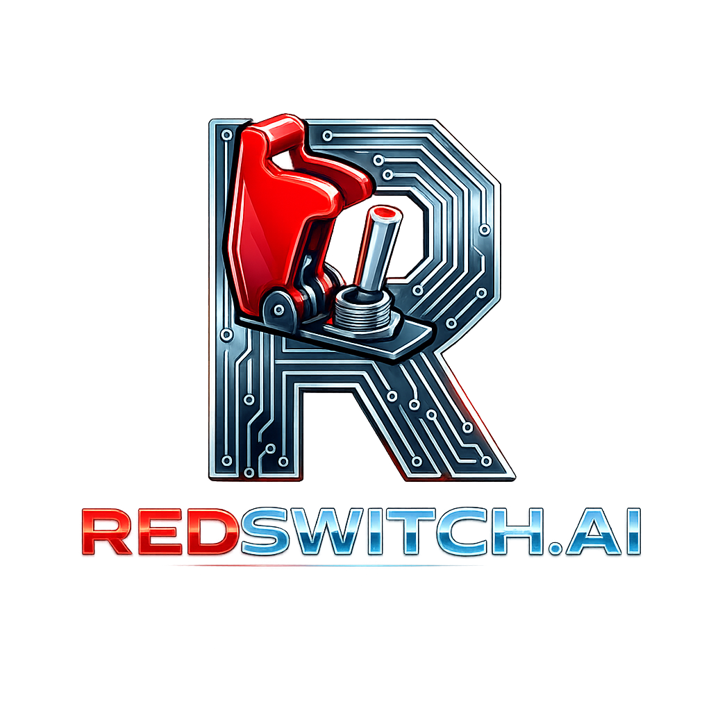

  

  <strong>The failsafe for autonomous AI agents</strong> 
  Open protocol for agent lifecycle management

  <a href="https://redswitch.ai">🌐 Website</a> •
  <a href="https://redswitch.ai/docs">📖 Docs</a> •
  <a href="https://pypi.org/project/redswitch/">🐍 PyPI</a> •
  <a href="https://redswitch.ai/dashboard">📊 Dashboard</a>

---

## 🚀 Quick Start

`ash
pip install redswitch
`

`python
from redswitch import RedSwitch

rs = RedSwitch(
    agent_id='my-agent',
    human_id='you@email.com',
    platform='openclaw'
)

rs.register()
rs.heartbeat()  # Call this periodically
`

## 📦 Projects

| Repo | Description |
|------|-------------|
| [sdk](https://github.com/Redswitch-Ai/sdk) | Python SDK for RedSwitch integration |

## 💡 Why RedSwitch?

- **Open Protocol** — MIT licensed, free forever
- **5 Minute Setup** — pip install and go
- **Family Protection** — Plain-English reports for non-technical loved ones
- **Multi-Channel Alerts** — Email, Telegram, SMS

---

*Built by [Evan Hubert](https://github.com/evanhubert) in Missouri, USA*